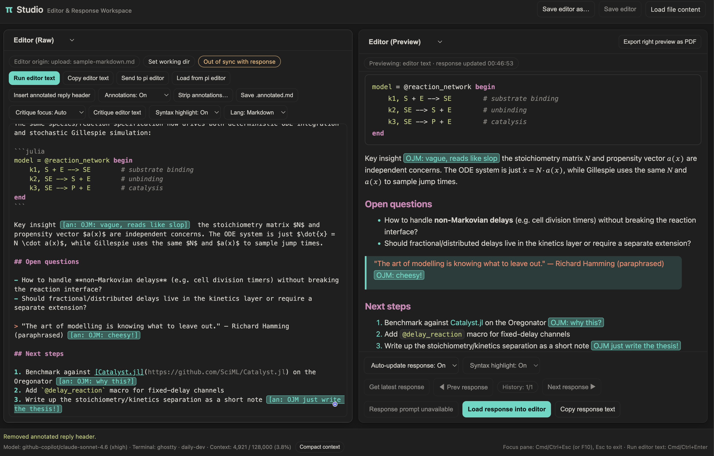
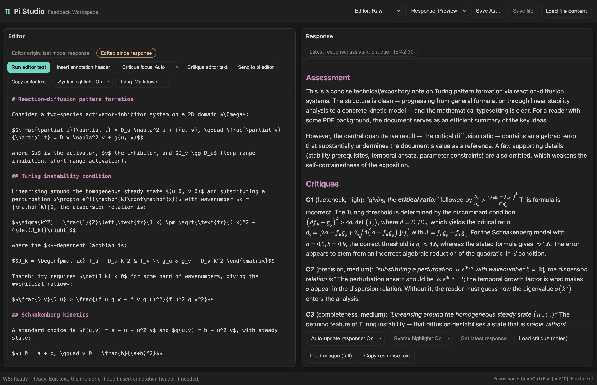
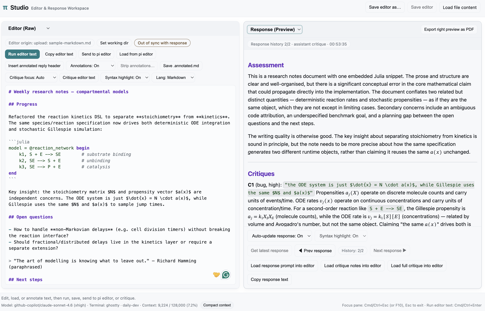
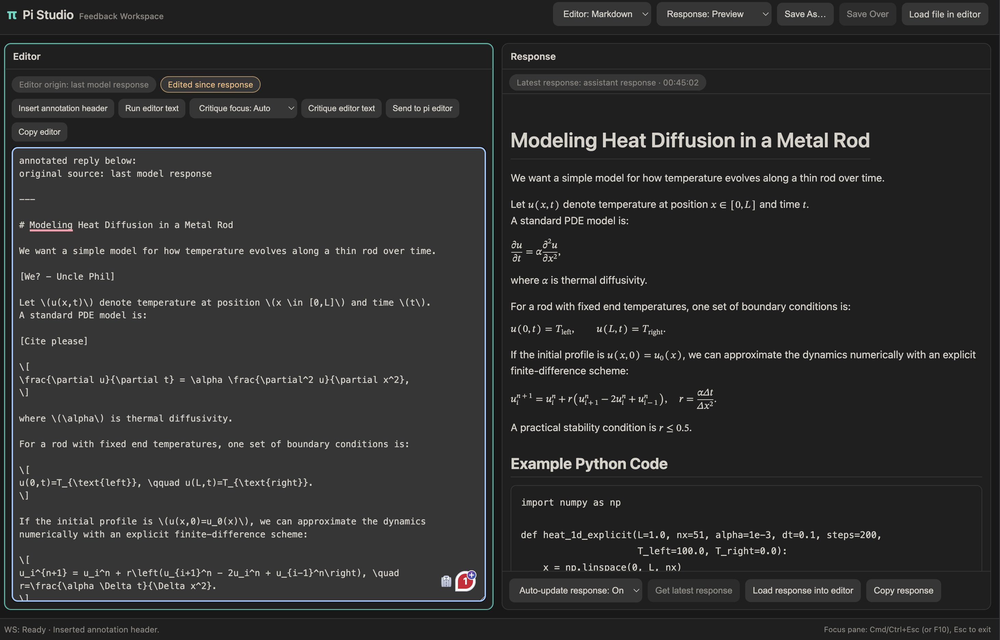

# Pi Studio: Feedback Workspace

Browser feedback workspace for two-way feedback workflows in pi (annotate + structured critique loops).

> ⚠️ **Status: Experimental (alpha)**
>
> Pi Studio is a local-first browser workspace for critical feedback and annotation workflows in pi.
> It is **not** a full IDE or standalone editor replacement.
> Current scope: single-user, local server + browser UI, and one request at a time.

## Screenshots

**Dark theme workspace**



**Dark theme critique flow**



**Light theme workspace**



**Dark theme annotation editing**



## Install

```bash
cd ~/.pi/agent/extensions/pi-studio
npm install
```

Or as a package (when published):

```bash
pi install npm:pi-studio
```

## Usage

Start pi, then run:

```bash
/studio
```

Default behavior for `/studio`:
- loads the last assistant response if available
- otherwise starts blank

Open studio with a file preloaded (for terminal ↔ studio workflow):

```bash
/studio ./path/to/draft.md
```

Force startup source:

```bash
/studio --last
/studio --blank
```

Optional commands:

```bash
/studio --status
/studio --stop
/studio --help
```

## Workflow

Studio now uses a single always-on workspace:

- **Left pane (Editor):** edit/annotate working text.
- **Right pane (Response):** latest assistant response (normal reply or critique).

Top controls:
- **Save As…** and **Save Over** (when file-backed)
- **Load file in editor**: opens the browser file picker and loads the selected file into the editor pane.
- pane view toggles (`Editor: Markdown|Preview`, `Response: Markdown|Preview`)

Editor actions:
- **Insert annotation header**: prepends/updates the annotated-reply scaffold in the editor.
- **Run editor text**: sends current editor text to the model unchanged.
- **Critique editor text** (+ critique focus): critiques current editor text and loads result into Response pane.
- **Send to pi editor**, **Copy editor**

Important:
- Studio does **not** auto-wrap editor text with an annotation header on run.
- If you want annotated-reply format, click **Insert annotation header** first, then run.

Response actions:
- **Auto-update response: On|Off** + **Get latest response**
- **Load response into editor** (shown for non-critique responses)
- **Load critique (notes)** (`## Assessment` + `## Critiques`, shown for structured critique responses)
- **Load critique (full)** (full structured critique response)
- **Copy response**

Additional behavior:
- editor sync badge (`No response loaded`, `In sync with response`, `Edited since response`)
- response badge with source + timestamp (`assistant response` / `assistant critique`)
- theme-aware palette from the active pi theme at `/studio` launch (re-open Studio after changing themes)
- keyboard shortcuts: `Cmd/Ctrl+Esc` (or `F10`) toggles active-pane focus mode; `Esc` exits focus mode
- footer status includes explicit WS phase (`Connecting`, `Ready`, `Submitting`, `Disconnected`)

## Design docs

- Workflow spec: [`WORKFLOW.md`](./WORKFLOW.md)
- Backlog: [`TODO.md`](./TODO.md)
- Changes: [`CHANGELOG.md`](./CHANGELOG.md)

## Notes

- Local-only server (`127.0.0.1`) with rotating session tokens.
- Studio URLs include a token query parameter; avoid sharing full Studio URLs in screenshots/issues.
- One studio request at a time.
- Browser supports: Save As, Save Over (file-backed editor text), Send to pi editor, Run editor text (submit editor text directly to model), Copy editor, annotation-header insertion, and response→editor load actions.
- Preview panes render markdown server-side via `pandoc` (`gfm+tex_math_dollars` → HTML5 + MathML), then sanitize in-browser with `dompurify`.
- Install `pandoc` for full preview rendering (`brew install pandoc` on macOS).
- Math delimiters supported in preview: `$...$`, `$$...$$`, `\(...\)`, and `\[...\]` (normalized before rendering).
- If `pandoc` is unavailable, Studio falls back to plain markdown text in preview panes and shows an inline warning.
