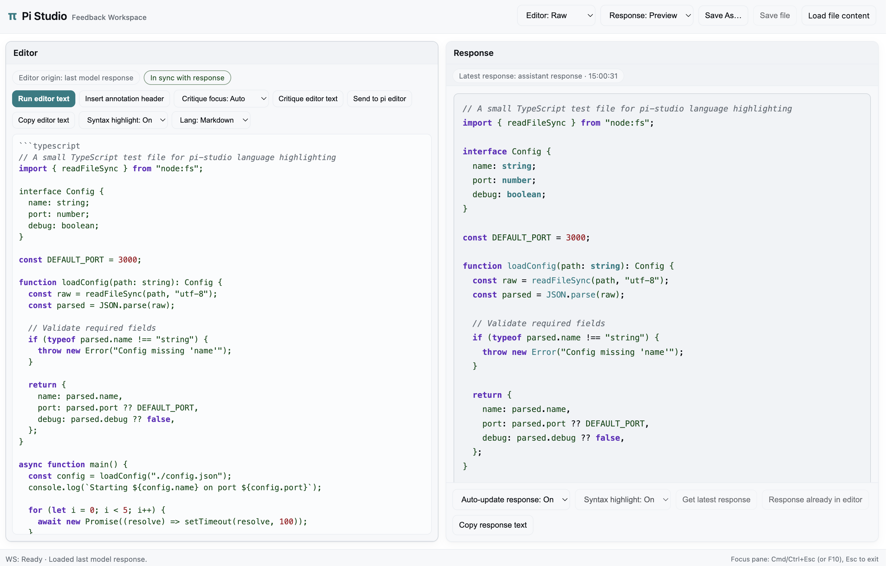
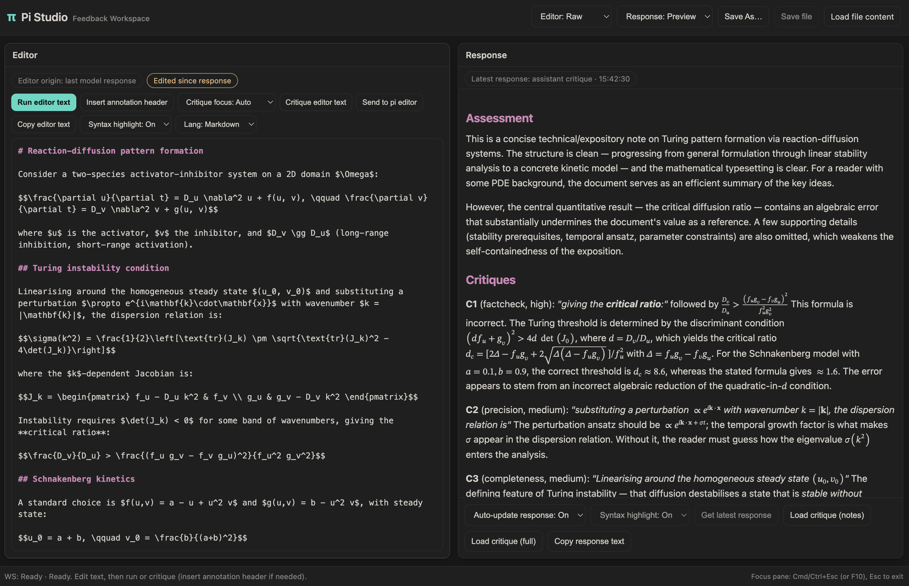
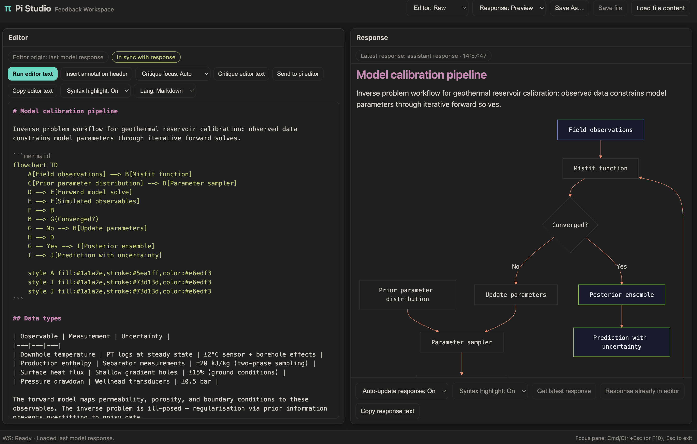
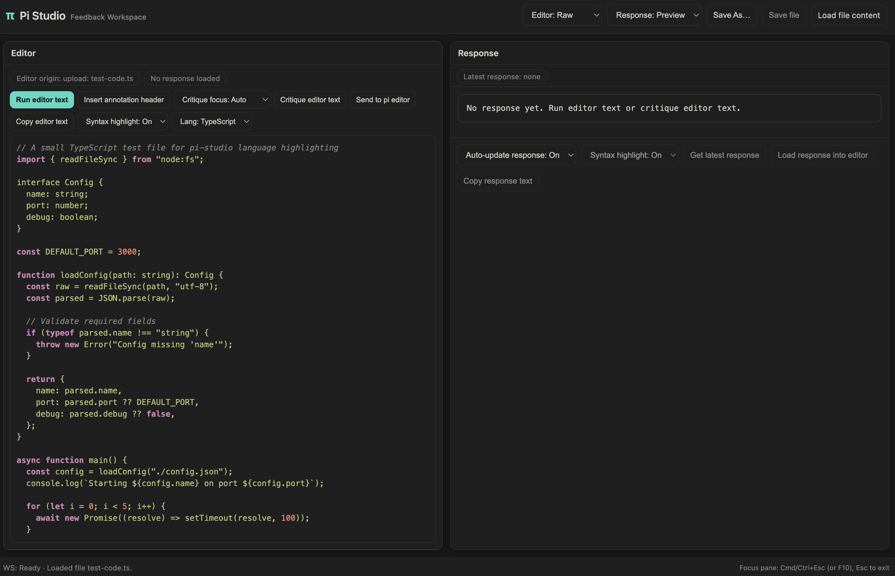
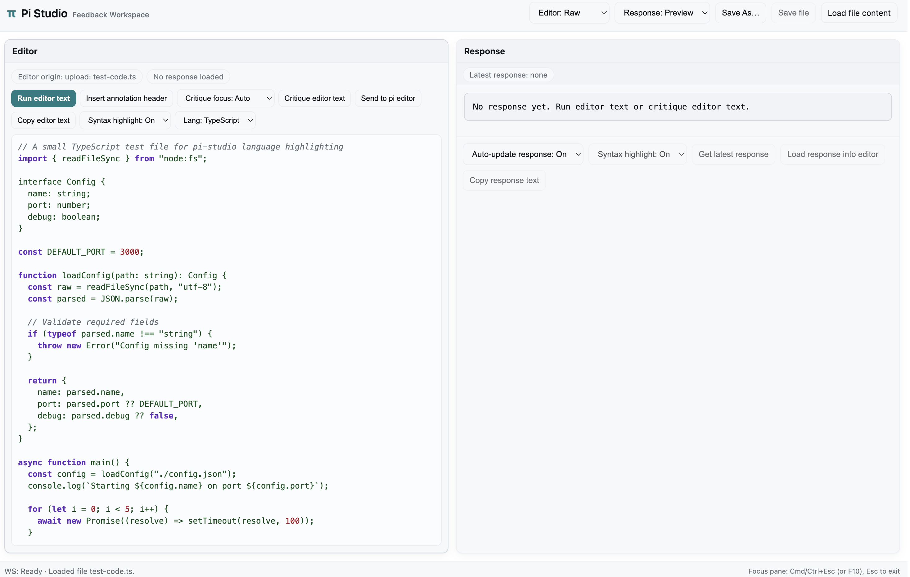
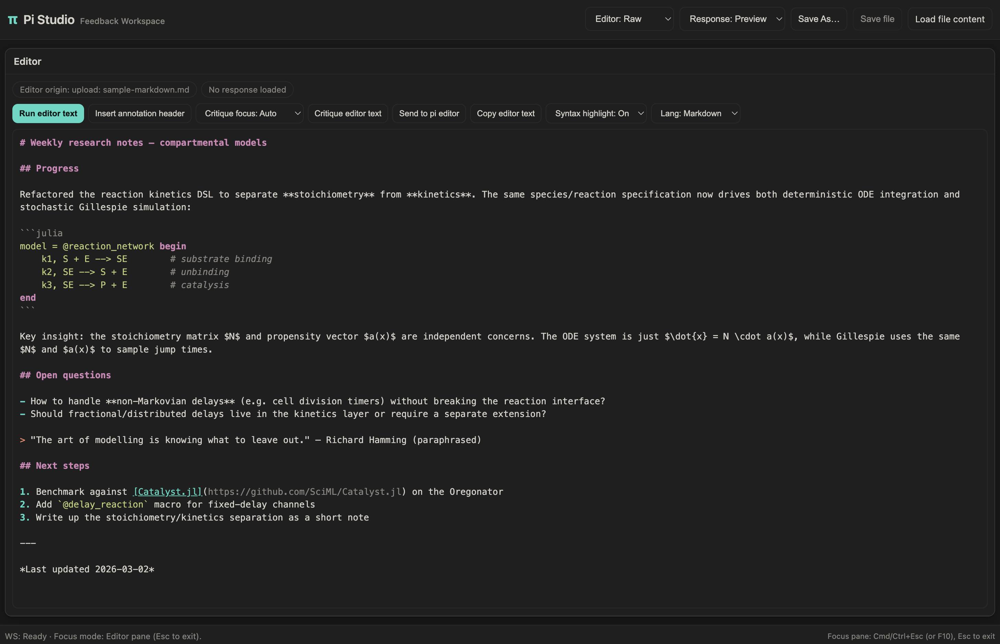

# pi-studio

Experimental extension for [pi](https://github.com/badlogic/pi-mono) that opens a local browser workspace for annotating model responses/files, running edited prompts, and requesting critiques.

Status: experimental alpha.

## Screenshots

**Markdown workspace — dark** (syntax-highlighted editor + rendered preview with Julia code block, inline math, blockquotes)


**Markdown workspace — light**


**Math rendering — dark** (LaTeX source → MathML: PDEs, matrices, display equations)



**Structured critique — dark** (assessment + numbered critiques with rendered math, "Edited since response" sync badge)



**Math rendering — light**


**Mermaid diagrams — dark** (fenced mermaid block → rendered flowchart with theme-aware colors)



**Code mode — dark** (TypeScript file loaded with language auto-detected from extension)



**Code mode — light**



**Focus mode — dark** (editor pane full-screen, `Cmd/Ctrl+Esc` or `F10` to toggle, `Esc` to exit)



## Features

- Single workspace: Editor (left) + Response (right)
- **Run editor text** sends editor content as-is
- **Insert annotation header** adds/updates annotated-reply scaffold
- **Critique editor text** requests structured critique (auto/writing/code focus)
- Response load helpers:
  - non-critique: **Load response into editor**
  - critique: **Load critique (notes)** / **Load critique (full)**
- File actions: **Save As…**, **Save file**, **Load file content**
- View toggles: `Editor: Raw|Preview`, `Response: Raw|Preview`
- Preview mode supports MathML equations and Mermaid fenced diagrams
- **Language-aware syntax highlighting** with selectable language mode:
  - Markdown (default): headings, links, code fences, lists, quotes, inline code
  - Code languages: JavaScript, TypeScript, Python, Bash, JSON, Rust, C, C++, Julia, Fortran, R, MATLAB
  - Keywords, strings, comments, numbers, and variables highlighted using theme syntax color tokens
  - Language auto-detected from file extension on file load; manually selectable via `Lang:` dropdown
  - Applies to both editor Raw view (highlight overlay) and fenced code blocks in markdown
  - Preview mode renders syntax-highlighted code when a non-markdown language is selected
- Separate syntax highlight toggles for editor and response Raw views, with local preference persistence
- Theme-aware browser UI derived from current pi theme

## Commands

| Command | Description |
|---------|-------------|
| `/studio` | Open studio with last assistant response (fallback: blank) |
| `/studio <path>` | Open studio with file preloaded |
| `/studio --last` | Force load from last assistant response |
| `/studio --blank` | Force blank editor start |
| `/studio --status` | Show studio server status |
| `/studio --stop` | Stop studio server |
| `/studio --help` | Show command help |

## Install

From GitHub:

```bash
pi install https://github.com/omaclaren/pi-studio
```

From npm:

```bash
pi install npm:pi-studio
```

Run without installing:

```bash
pi -e https://github.com/omaclaren/pi-studio
```

## Notes

- Local-only server (`127.0.0.1`) with rotating session tokens.
- One studio request at a time.
- Pi Studio supports both markdown workflows (model responses, plans, and notes) and code file editing with language-aware syntax highlighting.
- Studio URLs include a token query parameter; avoid sharing full Studio URLs.
- Preview panes render markdown via `pandoc` (`gfm+tex_math_dollars` → HTML5 + MathML), including pandoc code syntax highlighting, sanitized in-browser with `dompurify`.
- Preview markdown/code colors are mapped from active theme markdown (`md*`) and syntax (`syntax*`) tokens for closer terminal-vs-browser parity.
- Mermaid fenced `mermaid` code blocks are rendered client-side in preview mode (Mermaid v11 loaded from jsDelivr), with palette-driven defaults for better theme fit.
- If Mermaid cannot load or a diagram fails to render, preview shows an inline warning and keeps source text visible.
- Preview rendering normalizes Obsidian wiki-image syntax (`![[path]]`, `![[path|alt]]`) into standard markdown images.
- Install pandoc for full preview rendering (`brew install pandoc` on macOS).
- If `pandoc` is unavailable, preview falls back to plain markdown text with an inline warning.

## License

MIT
