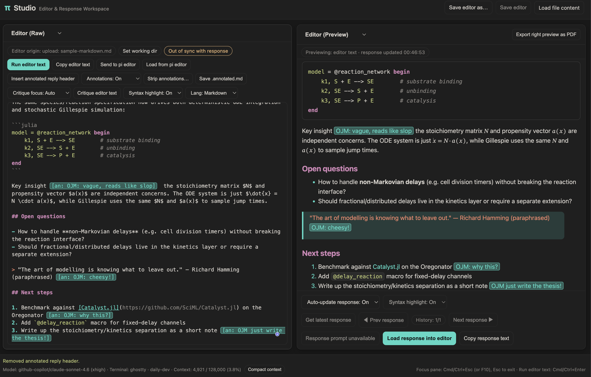
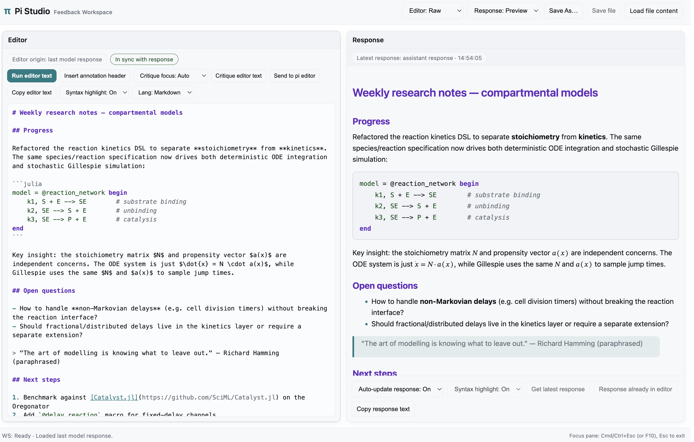

# pi-studio

Extension for [pi](https://pi.dev) that opens a local two-pane browser workspace for working with prompts, responses, Markdown and LaTeX documents, code files, and other common text-based files side by side. Annotate responses and files, write, edit, and run prompts, browse prompt and response history, request critiques, and use live preview for code, Markdown, and LaTeX.

## Screenshots

**Dark**



**Light**



## What it does

- Opens a two-pane browser workspace: **Editor** (left) + **Response/Thinking/Editor Preview** (right)
- Runs editor text directly, or asks for structured critique (auto/writing/code focus)
- Browses response history (`Prev/Next/Last`) and loads either:
  - response text
  - critique notes/full critique
  - assistant thinking (when available)
  - the prompt that generated a selected response
- Supports an annotation workflow for `[an: ...]` markers:
  - inserts/removes the annotated-reply header
  - shows/hides annotation markers in preview
  - strips markers before send (optional)
  - saves `.annotated.md`
- Renders Markdown/LaTeX/code previews (math + Mermaid), theme-synced with pi
- Exports right-pane preview as PDF (pandoc + LaTeX)
- Exports local files headlessly via `/studio-pdf <path>` to `<name>.studio.pdf`
- Shows model/session/context usage in the footer, plus a compact-context action

## Commands

| Command | Description |
|---|---|
| `/studio` | Open with last assistant response (fallback: blank) |
| `/studio <path>` | Open with file preloaded |
| `/studio --last` | Force last response |
| `/studio --blank` | Force blank editor |
| `/studio --status` | Show studio server status |
| `/studio --stop` | Stop studio server |
| `/studio --help` | Show help |
| `/studio-current <path>` | Load a file into currently open Studio tab(s) without opening a new browser window |
| `/studio-pdf <path>` | Export a local file to `<name>.studio.pdf` via the Studio PDF pipeline |

## Install

```bash
# npm
pi install npm:pi-studio

# GitHub
pi install https://github.com/omaclaren/pi-studio
```

Run once without installing:

```bash
pi -e https://github.com/omaclaren/pi-studio
```

## Notes

- Local-only server (`127.0.0.1`) with rotating tokenized URLs.
- Studio is designed as a complement to terminal pi, not a replacement.
- Editor/code font uses a best-effort terminal-monospace match when the current terminal config exposes it; set `PI_STUDIO_FONT_MONO` to force a specific CSS `font-family` stack.
- Full preview/PDF quality depends on `pandoc` (and `xelatex` for PDF):
  - `brew install pandoc`
  - install TeX Live/MacTeX for PDF export
- Mermaid diagrams in exported PDFs may also require Mermaid CLI (`mmdc` / `@mermaid-js/mermaid-cli`) when you want diagram blocks rendered as diagrams rather than left as code.

## License

MIT
