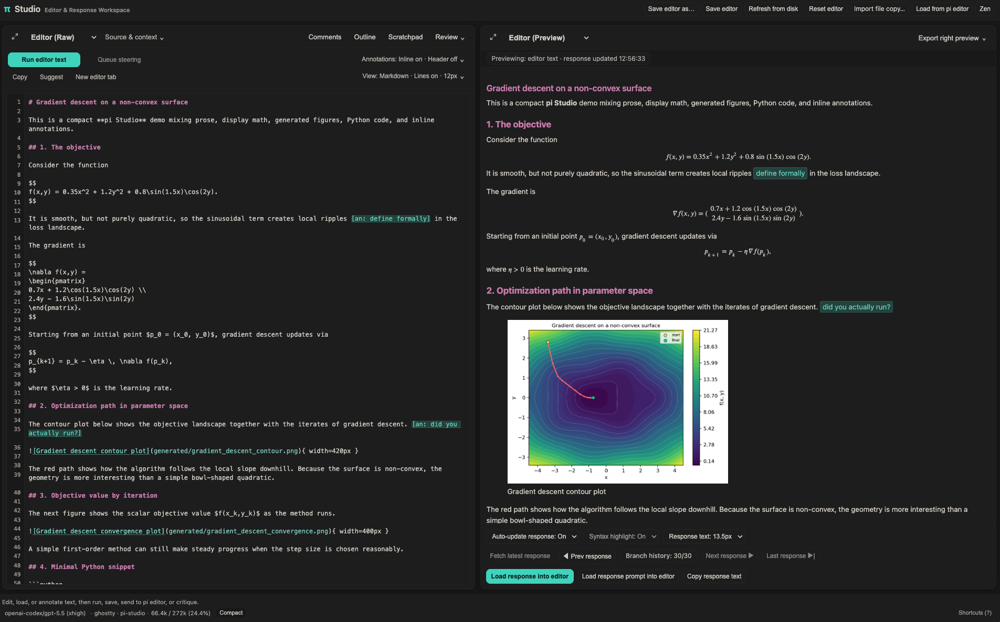
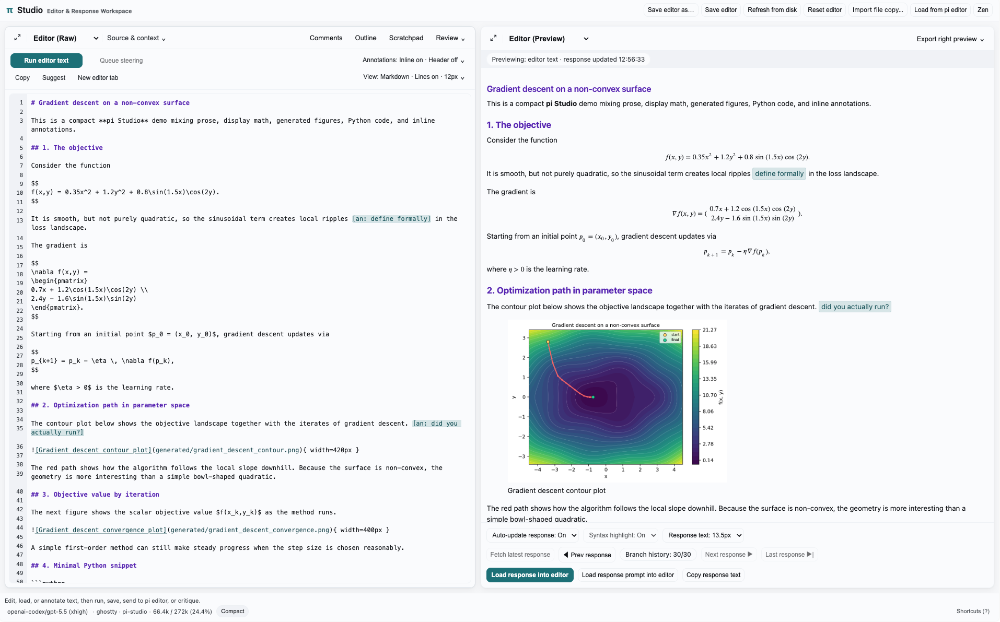

# pi-studio

Extension for [pi](https://pi.dev) that opens a local two-pane browser workspace for working with prompts, responses, live working details, Markdown and LaTeX documents, code files, and other common text-based files side by side. Annotate responses and files, add local comments, write, edit, and run prompts, browse prompt and response history, request critiques, and use live preview for code, Markdown, and LaTeX.

## Quick demo

[Watch the 2-minute demo (MP4, 2x speed, no audio)](https://github.com/omaclaren/pi-studio/releases/latest/download/pi-studio-demo-2min.mp4)

## Screenshots

**Dark**



**Light**



## What it does

- Opens a two-pane browser workspace: **Editor** (left) + **Response/Working/Editor Preview** (right)
- Supports one canonical full Studio view per Pi session, plus additional editor-only companion views when you just want extra editing/preview surfaces
- Runs editor text directly, or asks for structured critique (auto/writing/code focus)
- Includes a live **Working** view for following current model/tool activity, with `All` / `Thinking` / `Tools` filters plus **Load visible into editor** and **Copy visible** actions
- Includes a local persistent scratchpad for quick notes you want to keep out of the main editor until you're ready to copy or insert them
- Includes a docked **Outline** rail for navigating document structure in the current editor text, with clickable entries that jump in the raw editor and reveal matching preview locations when available
- Includes local comments anchored to selections/lines, shown in a docked **Comments** rail, with transient **Comment** / **Jump** actions from raw-editor selections plus editor-preview selections for Markdown, LaTeX, and code/text/diff previews, alongside optional inline `[an: ...]` toggles when you want comments reflected in the document text
- Browses response history (`Prev/Next/Last`) and loads either:
  - response text
  - critique notes/full critique
  - the prompt that generated a selected response
- Supports an annotation workflow for `[an: ...]` markers:
  - inserts/removes the annotated-reply header
  - shows/hides annotation markers in preview
  - strips markers before send (optional)
  - saves `.annotated.md`
- Renders Markdown/LaTeX/code previews (math + Mermaid), theme-synced with pi
- Ships optional `pi-studio-dark` and `pi-studio-light` themes tuned for Studio's browser workspace
- Exports right-pane preview as PDF (pandoc + LaTeX)
- Exports local files headlessly via `/studio-pdf <path>` to `<name>.studio.pdf`
- Shows model/session/context usage in the footer, plus a compact-context action

## Commands

| Command | Description |
|---|---|
| `/studio` | Open with last assistant response (fallback: blank) |
| `/studio <path>` | Open with file preloaded |
| `/studio --last` | Force last response |
| `/studio --blank` | Force blank editor |
| `/studio --status` | Show studio server status |
| `/studio --stop` | Stop studio server |
| `/studio --help` | Show help |
| `/studio-replace [path\|--blank\|--last]` | Replace the current full Studio view with a new full Studio view |
| `/studio-editor-only [path\|--blank\|--last]` | Open an editor-only Studio view; multiple editor-only views may be open at once |
| `/studio-current <path>` | Load a file into currently open Studio tab(s) without opening a new browser window |
| `/studio-pdf <path> [options]` | Export a local file to `<name>.studio.pdf` via the Studio PDF pipeline, with optional layout controls |

## Install

```bash
# npm
pi install npm:pi-studio

# GitHub
pi install https://github.com/omaclaren/pi-studio
```

Run once without installing:

```bash
pi -e https://github.com/omaclaren/pi-studio
```

## Notes

- Local-only server (`127.0.0.1`) with tokenized Studio URLs.
- For remote SSH sessions, keep Studio bound to localhost and use SSH local port forwarding; `/studio` and `/studio --status` print the full tokenized localhost URL. The SSH hint repeats the full URL so it is visible even if your terminal only shows the latest notification. Open that URL through the tunnel, preserving the `?token=...` parameter.
- Full Studio is a singleton per Pi session: use `/studio` to open it, `/studio-replace` to explicitly replace it, and `/studio-editor-only` for extra editing/preview tabs that do not take over the full Studio session view.
- Studio is designed as a complement to terminal pi, not a replacement.
- Installing pi-studio makes the optional `pi-studio-dark` and `pi-studio-light` themes available in pi's theme selector; it does not change your active theme.
- Editor/code font uses a best-effort terminal-monospace match when the current terminal config exposes it; set `PI_STUDIO_FONT_MONO` to force a specific CSS `font-family` stack. Use `PI_STUDIO_FONT_UI` or `PI_STUDIO_FONT_PROSE` to override the Studio UI or rendered-preview font stacks.
- Full preview/PDF quality depends on `pandoc` (and `xelatex` for PDF):
  - `brew install pandoc`
  - install TeX Live/MacTeX for PDF export
- Mermaid diagrams in exported PDFs may also require Mermaid CLI (`mmdc` / `@mermaid-js/mermaid-cli`) when you want diagram blocks rendered as diagrams rather than left as code.

## License

MIT
