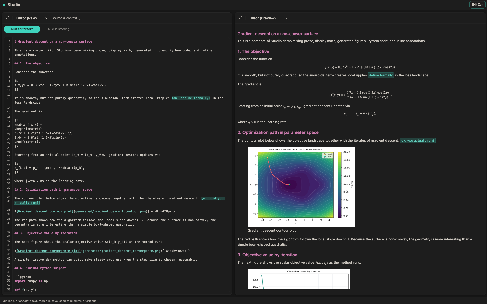
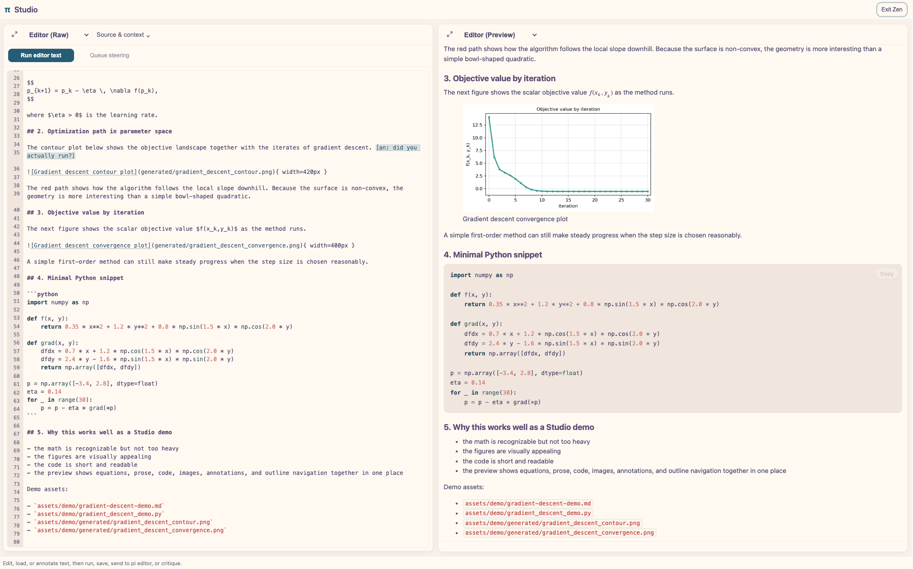
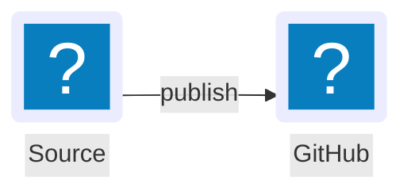

# pi-studio

Extension for [pi](https://pi.dev) that opens a local two-pane browser workspace for working with prompts, responses, live working details, Markdown and LaTeX documents, interactive HTML previews, code files, REPL sessions, and other common text-based files side by side. Annotate responses and files, add local comments, write, edit, run prompts, send code to a REPL, browse prompt and response history, request critiques, and use live preview for code, Markdown, LaTeX, and interactive HTML.

See [`ROADMAP.md`](./ROADMAP.md) for the current release plan.

## Quick demo

[Watch the 2-minute demo (MP4, 2x speed, no audio)](https://github.com/omaclaren/pi-studio/releases/latest/download/pi-studio-demo-2min.mp4)

_The video shows an earlier version of the Studio interface. The basic workflow is the same, but there have been minor UI changes since it was recorded; the screenshots show the more recent version._

## Screenshots

**Dark workspace**


**Light workspace**


**Zen mode**



**Zen mode with a custom theme and rendered code preview**



## What it does

- Opens a two-pane browser workspace: **Editor** (left) + **Response/Working/Editor Preview/Quarto Preview/Side questions** (right)
- Supports one canonical full Studio view per Pi session, plus additional editor-only companion views when you want extra editing/preview surfaces; editor-only views can also browse files and use the Studio REPL send controls without taking over the full Studio session view
- Includes a global **Zen** mode that hides the Studio header and secondary chrome without changing the current left/right pane layout; the header can also be hidden independently and restored from the top-right edge
- Runs editor text directly, asks for structured critique (auto/writing/code focus), offers explicit **Show me** actions for a one-turn compact visual or structural explanation of the editor selection/document, displayed response, or current conversation topic, provides a manual **Suggest completion** action for short cursor-aware continuations (`Option/Alt+Tab` where available or `Cmd/Ctrl+Shift+Space` from the editor, `Tab` to insert a visible suggestion) with an optional editor-plus-latest-response context mode, or opens **Quiz me** for a Studio-native active-recall loop over the current editor text, selection, current file, folder, or repo, with optional focus guidance for shaping question selection
- Adds a right-pane **Side questions** thread for contextual questions that stay outside the main Pi conversation unless explicitly promoted. It can start with the editor selection, the Markdown/LaTeX heading block at the cursor, nearby unstructured text, the whole editor, the displayed response, or no starting text; independently, it can use read-only tools to map, search, and read the document folder, repository, or another chosen folder—including extracted PDF, DOCX, ODT, and EPUB text—and can optionally search the web through Brave Search.
- Includes a live **Working** view for following current model/tool activity, with `All` / `Thinking` / `Tools` filters, image previews for image-producing tool outputs, plus **Load visible into editor** and **Copy visible** actions; when cycling response history, Working follows saved working details for the selected response when available, and `Cmd/Ctrl+Alt+1–8` switches directly between right-pane views while `Cmd/Ctrl+Alt+P` / `Cmd/Ctrl+Alt+E` / `Cmd/Ctrl+Alt+W` / `Cmd/Ctrl+Alt+F` / `Cmd/Ctrl+Alt+Q` keep quick mnemonic shortcuts for Response Preview, Editor Preview, Working, Files, and Side questions
- Includes a right-pane **Changes** view for browsing the current git diff by file, previewing per-file diffs, opening changed files, loading the full diff into the editor, and copying the diff
- Includes a right-pane **Files** view rooted in folders allowed for the current Studio session, with an **Allow folder…** action and location selector; exact-file grants can still be opened independently without exposing their parent folders. Files supports sorting by name/modified time/size, opening folders or the current root in Finder/the system file manager, loading text/code/CSV/TSV documents into the editor, previewing PDFs/images, opening previews in new Studio tabs, converting DOCX/ODT documents to editable Markdown when Pandoc is available after confirmation, copying paths, setting the current folder as the Studio working directory, and revealing files in the file manager
- Imports detached text-file copies either through the browser's file picker or from a path on the computer running Pi, keeping the path option available in embedded and remote browser views; imported copies remain detached until saved or opened as file-backed documents
- Includes an optional tmux-backed **REPL** view for Shell, Python, IPython, Julia, R, GHCi, and Clojure sessions, with Raw/Literate send modes, `Cmd/Ctrl+Shift+Enter` **Send to REPL**, session start/stop/interrupt controls, a compact refresh-persistent **Studio REPL Record** of user and Pi-sent code, a secondary raw tmux mirror, agent-facing `studio_repl_status` / `studio_repl_send` tools, and Markdown/PDF/HTML export
- Includes a local persistent scratchpad for quick notes you want to keep out of the main editor until you're ready to copy or insert them, with a **Recent…** picker for recovering scratchpads saved under earlier file/draft identities
- Includes a docked **Outline** rail for navigating document structure in the current editor text, with clickable entries that jump in the raw editor and reveal matching preview locations when available
- Restores each browser tab’s editor workspace after refresh or cmux hidden-surface reconstruction, and provides an explicit **Reset editor** action when you want to discard the restored draft and return the tab to a fresh blank draft without changing responses or saved files
- Turns local preview links, including links inside sandboxed HTML previews, into Studio actions: PDFs open in the embedded viewer, images open in a zoomable focus viewer, PDF/image links can open in a new Studio preview tab, text/code/CSV/TSV document links can open in a new editor tab, DOCX/ODT links can be converted to editable Markdown, and right-click menus provide **Open here**, **Reveal in file manager**, and **Copy path** for local resources
- Includes local comments anchored to selections/lines, shown in a docked **Comments** rail, with transient **Comment** / **Jump** actions from raw-editor selections plus editor-preview selections for Markdown, LaTeX, code/text/diff previews, and an opt-in comment mode for editor HTML previews; source-anchored comments can be toggled into inline `[an: ...]` annotations when you want comments reflected in the document text
- Browses response history (`Prev/Next/Last`) and loads either:
  - response text, with a one-click **Annotate response** action that also opens **Editor (Preview)**
  - critique notes/full critique
  - the prompt that generated a selected response
- Supports an annotation workflow for `[an: ...]` markers:
  - inserts/removes the annotated-reply header
  - shows/hides annotation markers in preview
  - strips markers before send (optional)
  - saves `.annotated.md`
- Renders Markdown/LaTeX/code previews (math + Mermaid) plus lightweight CSV/TSV table previews, theme-synced with pi, with an explicit H1–H6 hierarchy, zoomable images across Studio-owned Markdown surfaces, and copy buttons for code blocks and blockquotes; already allowed local media loads silently, while blocked images and embedded PDFs remain unloaded behind an explicit per-file or containing-folder allow action; Mermaid previews include Lucide/Logos icon nodes and accessible label contrast over custom fills
- Adds a contextual **Editor (Quarto Preview)** right-pane view for file-backed `.qmd`, `.md`, and `.markdown` documents. Studio checks Quarto and the document/project configuration before showing an explicit start action, launches a single loopback `quarto preview` process with `--no-execute`, embeds Quarto's authoritative saved-file output without restyling it, and provides open-in-browser, restart, stop, logs, and unsaved-editor warnings. If Quarto is missing, the view remains available with an actionable dependency message.
- Renders straight, unfenced interactive HTML in preview via a sandboxed browser iframe with zoom controls, while fenced `html` blocks remain source code
- Embeds local PDFs in Studio Markdown previews via explicit `studio-pdf` fenced blocks and opens existing PDFs directly with `/studio <path.pdf>`, with visible enlarge, browser-tab, system-viewer, show-in-folder, copy-path, manual refresh, and opt-in stable-file auto-refresh actions; true browser fullscreen is offered only when the browser supports it
- Ships optional `pi-studio-dark` and `pi-studio-light` themes tuned for Studio's browser workspace
- Exports right-pane preview as PDF (pandoc + LaTeX) or standalone HTML into the source file directory, Studio working directory, or Pi session directory; PDF export can open in a Studio preview tab or the default PDF viewer, and HTML export can open in the default browser or in a new Studio editor tab for inspection/commenting, while preserving authored HTML previews as HTML and rendering CSV/TSV editor previews as tables
- Exports local files headlessly via `/studio-pdf <path>` to `<name>.studio.pdf` or `/studio-html <path>` to `<name>.studio.html`; without a path, those commands export the last model response to a timestamped file. Agent tools `studio_export_pdf` and `studio_export_html` expose the same export pipeline for remote/Telegram-style sessions.
- Shows model/session/context usage in the footer, plus compact-context and active-theme controls

## Commands

| Command | Description |
|---|---|
| `/studio` | Open in Muxy or cmux when available, otherwise the system browser, with the last assistant response (fallback: blank) |
| `/studio <path>` | Open a text file in the editor, or a PDF in a read-only companion preview tab |
| `/studio --watch <pdf>` | Open a local PDF with stable-file auto-refresh enabled |
| `/studio --last` | Force last response |
| `/studio --blank` | Force blank editor |
| `/studio --no-browser` | Start/print the Studio URL without opening a browser, useful for forwarded or phone/browser sessions |
| `/studio --port <port>` | Bind Studio to a fixed localhost port instead of a random free port |
| `/studio --status` | Show studio server status |
| `/studio --stop` | Stop studio server |
| `/studio --help` | Show help |
| `/studio-replace [path\|--blank\|--last]` | Replace the current full Studio view with a new full Studio view |
| `/studio-editor-only [path\|--blank\|--last]` | Open an editor-only view, or a read-only PDF preview; multiple companion views may be open at once |
| `/studio-current <path>` | Load a file into currently open Studio tab(s) without opening a new browser window |
| `/studio-pdf [path] [options]` | Export a local file, or the last model response when no path is given, via the Studio PDF pipeline |
| `/studio-html [path]` | Export a local file, or the last model response when no path is given, to standalone HTML via the Studio preview pipeline |

## Agent tools

| Tool | Description |
|---|---|
| `studio_export_pdf` | Export direct Markdown/LaTeX, a local file, or the last model response to PDF. Defaults to writing a file without opening a viewer. |
| `studio_export_html` | Export direct Markdown/LaTeX, a local file, or the last model response to standalone HTML. Defaults to writing a file without opening a viewer. |

## Install

```bash
# npm
pi install npm:pi-studio

# GitHub
pi install https://github.com/omaclaren/pi-studio
```

Run once without installing:

```bash
pi -e https://github.com/omaclaren/pi-studio
```

## Side questions and research context

Open **Review → Side question**, select **Side questions** in the right pane, or press **Cmd/Ctrl+Alt+Q**. A new side thread captures its starting text while keeping related-file access separate:

- **Starting text** controls what unsaved text begins the thread. The compact **Automatic: selection → heading block at cursor → nearby text** disclosure explains the fallback order; when expanded, it defines the heading boundary. The summary below reports the resolved starting text, editor line range when applicable, and character count separately from the related-file scope.
- Explicit **Editor selection only** no longer falls back to the whole document when no text is selected; the summary instead reports that no editor text is selected.
- In the initial-question and follow-up boxes, **Cmd/Ctrl+Enter** submits while plain **Enter** adds a new line. The button remains available for pointer and ordinary keyboard activation.
- **Also use files from** controls the read-only boundary available to the side agent: no other files, the document folder, the current repository, or another chosen folder. Related-file access requires an allowed folder for the current Studio session; if the selected root is not already allowed, Studio names the canonical folder and asks before starting the thread. An exact-file grant never exposes its parent folder.
- With **Repository** selected, **Include Git context** can capture status, staged and unstaged tracked-file changes, and up to 20 recent commit summaries. The bounded snapshot is frozen when the thread starts and exposed through fixed read-only tools; untracked contents remain available only through the existing root-confined file reader.
- **Include the current main conversation snapshot** is opt-in. Side questions and answers otherwise never enter the main Pi history; **Bring to main conversation** is the explicit handoff.
- Local context tools can map filenames, search readable text, and read selected ranges. Studio revalidates the allowed context root before prompts and built-in local tool calls; symlinks, root replacement, and traversal outside that root are rejected. PDF extraction uses `pdftotext`; DOCX, ODT, and EPUB extraction uses Pandoc.
- **Allow web search** is opt-in and appears when `BRAVE_API_KEY` is available to the Pi process. Model-chosen search queries are sent to Brave Search; the side agent is instructed not to copy private local passages into queries. Web answers cite result URLs and identify when they rely on search-result snippets rather than full page content.
- **Additional Pi tools** lists eligible tools already registered by the user's installed Pi extensions. Selection is explicit, remembered locally, and frozen when the thread starts. Studio reloads only the extensions owning the selected tools into the isolated side runtime and activates only those tool names; it does not import or depend on any particular third-party extension. Gateway tools are labelled and require an additional confirmation because selecting one may expose further services configured behind it.

The current side thread is ephemeral but survives Studio browser refreshes while the same Pi Studio server remains running. **Export thread** can save the visible discussion and context summary as Markdown, copy that Markdown, open it as an unsaved editor copy, or render it to PDF or HTML. Markdown is the canonical durable format; exports omit hidden starting-text contents, inherited main-conversation contents, and raw tool output. Studio never supplies the side agent with shell or file-writing tools, and known execution/mutation surfaces are excluded from the picker. Selected third-party tools retain their own behavior, permissions, and downstream scope, so choose tools you trust for read-only research.

## Studio Markdown extras

Studio previews standard Markdown, code fences, display math, Mermaid, and local images. The opened document directory and other explicitly allowed folders are available for local preview resources during the current Studio session. Media already inside those locations loads without interruption. An image or embedded PDF outside them stays unloaded and shows **Allow local image/PDF…**; activating that control offers an exact-file grant, a containing-folder grant for the session, or cancellation. Passive rendering itself never opens the permission decision.

When adding companion files such as generated plots or PDFs, prefer the project's existing folder convention. If there is no convention, `attachments/` is a reasonable default for newly generated assets. Use relative paths from the opened Markdown file or a folder allowed for the current Studio session, and wrap paths in angle brackets when spaces are possible:

```md

```

Local PDFs can be embedded with an explicit Studio-only fenced block:

````md
```studio-pdf
path: attachments/paper.pdf
title: Optional title
page: 3
height: 760
watch: true
caption: Optional caption
```
````

`path` must point to a local `.pdf`. Relative paths resolve from the opened document's directory, or from Studio's working directory for non-file-backed content; the resolved file must be inside a location allowed for the current Studio session before it loads. `page` is an initial page hint for the browser PDF viewer, `height` controls the embedded frame height in pixels, and `watch: true` enables auto-refresh after Studio observes the changed file in a stable state. Use normal Markdown links for PDFs when embedding is not useful.

To view an existing PDF directly, run `/studio report.pdf` (or `/studio "path with spaces/report.pdf"`). The PDF opens read-only in a focused companion preview, even when the full Studio workspace is already open. A `#page=N` suffix selects the initial page. Auto-refresh is off by default; use `/studio --watch report.pdf` to start with it on, or toggle **Auto-refresh** in the PDF card or focused viewer. Studio checks only while the tab is visible and waits for two matching file-version observations before reloading, which avoids reading a PDF while LaTeX is still writing it. **Cmd/Ctrl+Alt+R** manually refreshes the focused or visible PDF. This is distinct from `/studio-pdf`, which exports Markdown, LaTeX, code, or the last response to a new PDF.

### Mermaid icons

Studio's live previews and standalone HTML exports support Mermaid's `lucide:*` and `logos:*` icon nodes. The corresponding Iconify packs load lazily, so Studio does not fetch either pack unless a diagram uses it. Mermaid and the browser icon-pack URLs are pinned to tested versions.

````md

```mermaid
flowchart LR
  source@{ icon: "lucide:file-code-2", form: "rounded", label: "Source", pos: "b", h: 56 }
  github@{ icon: "logos:github-icon", form: "rounded", label: "GitHub", pos: "b", h: 56 }
  source -->|publish| github
```
````

Studio also corrects low-contrast Mermaid icon paints and node labels after browser rendering while preserving authored colours that already meet a 4.5:1 contrast ratio. For PDF output, Studio adds or corrects label colours on `classDef` and `style` declarations with solid hex/RGB fills and supplies targeted icon CSS to Mermaid CLI; this also covers Logos icons whose SVG paths use literal fills.

PDF icon nodes require Mermaid CLI 11.12+ so Studio can use pinned icon-pack URLs. Install a current CLI, or set `MERMAID_CLI_PATH` to one:

```bash
npm install -g @mermaid-js/mermaid-cli@11.16.0
mmdc --version
```

Studio only passes icon-pack arguments when a diagram actually references `lucide:` or `logos:`, so ordinary Mermaid PDF diagrams remain compatible with older CLI versions.

## Notes

- Local-only server (`127.0.0.1`) with tokenized Studio URLs.
- When Pi runs inside Muxy or cmux, Studio opens in that terminal app’s built-in browser. Muxy is detected from its pane/socket environment without installing global hooks; cmux targets and focuses the caller’s workspace. If the detected terminal browser is unavailable, disabled, or declines the request, Studio falls back once to the system browser.
- For remote SSH sessions, keep Studio bound to localhost and use SSH local port forwarding; `/studio` and `/studio --status` print the full tokenized localhost URL. The SSH hint repeats the full URL so it is visible even if your terminal only shows the latest notification. Open that URL through the tunnel, preserving the `?token=...` parameter. If SSH is not auto-detected, use `/studio --no-browser`; for stable forwarding, use `/studio --port <port>` or combine them, e.g. `/studio --no-browser --port 3417`.
- Full Studio is a singleton per Pi session: use `/studio` to open it, `/studio-replace` to explicitly replace it, and `/studio-editor-only` for extra editing/preview tabs that do not take over the full Studio session view.
- Studio is designed as a complement to terminal pi, not a replacement.
- Installing pi-studio makes the optional `pi-studio-dark` and `pi-studio-light` themes available in pi's theme selector; it does not change your active theme.
- Editor/code font uses a best-effort terminal-monospace match when the current terminal config exposes it; set `PI_STUDIO_FONT_MONO` to force a specific CSS `font-family` stack. Use `PI_STUDIO_FONT_UI` or `PI_STUDIO_FONT_PROSE` to override the Studio UI or rendered-preview font stacks.
- The optional REPL view requires `tmux`. Studio can start and stop Studio-owned `pi-studio-repl-*` sessions and can mirror detected `pi-repl-*` sessions, but it will not stop external `pi-repl-*` sessions.
- Side-question web search requires `BRAVE_API_KEY`; without it, local and conversation context still work, and the web option is shown as unavailable. Side sub-sessions are deliberately read-only and can run independently while the main Pi agent is busy.
- Full preview/PDF quality depends on `pandoc` (and `xelatex` for PDF):
  - `brew install pandoc`
  - install TeX Live/MacTeX for PDF export
- LaTeX browser previews and **Export right preview** are semantic Pandoc conversions rather than authoritative compilation of the original source layout. If a local legacy `.sty` package overrides LaTeX document startup in a way that prevents Pandoc from reading the document, Studio omits that package from the conversion only, preserves local includes, and shows a warning; compile the original source directly with LaTeX for exact package-specific layout.
- **Editor (Quarto Preview)** is optional and requires the `quarto` CLI on Studio's `PATH`. It supports saved `.qmd`, `.md`, and `.markdown` files, whether standalone or part of a Quarto project. Selecting the view only inspects the saved document; starting the preview is explicit. Studio passes `--no-execute`, which prevents computational cells from running, but trusted Quarto project extensions, filters, configuration, and render hooks are still processed, and Quarto may create or update its normal rendered output files. The preview reflects disk, not unsaved editor text.
- Quarto serves its embedded page on a second random loopback port. When Studio itself is reached through SSH port forwarding, that Quarto port (shown in **Show log**) must also be forwarded, or the preview should be opened from a Studio process running on the browser's machine.
- Export subprocess timeouts default to bounded values and can be tuned with `PI_STUDIO_PANDOC_TIMEOUT_MS`, `PI_STUDIO_LATEX_TIMEOUT_MS`, `PI_STUDIO_MERMAID_TIMEOUT_MS`, and `PI_STUDIO_HTML_RENDER_OUTPUT_MAX_BYTES` for unusually large embedded-asset HTML exports.
- Mermaid diagrams in exported PDFs require Mermaid CLI (`mmdc` / `@mermaid-js/mermaid-cli`) when you want diagram blocks rendered as diagrams rather than left as code; PDF icon nodes require Mermaid CLI 11.12+.

## License

MIT
