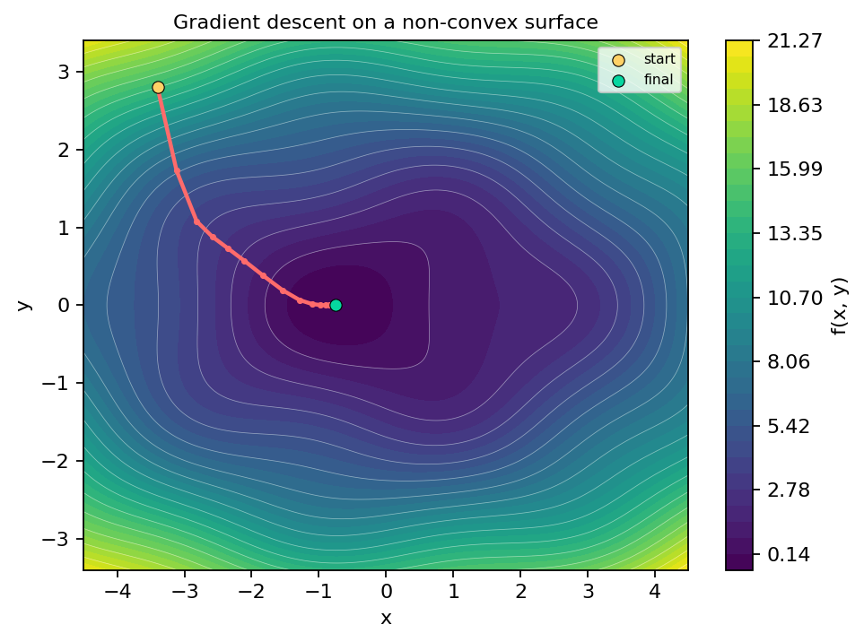
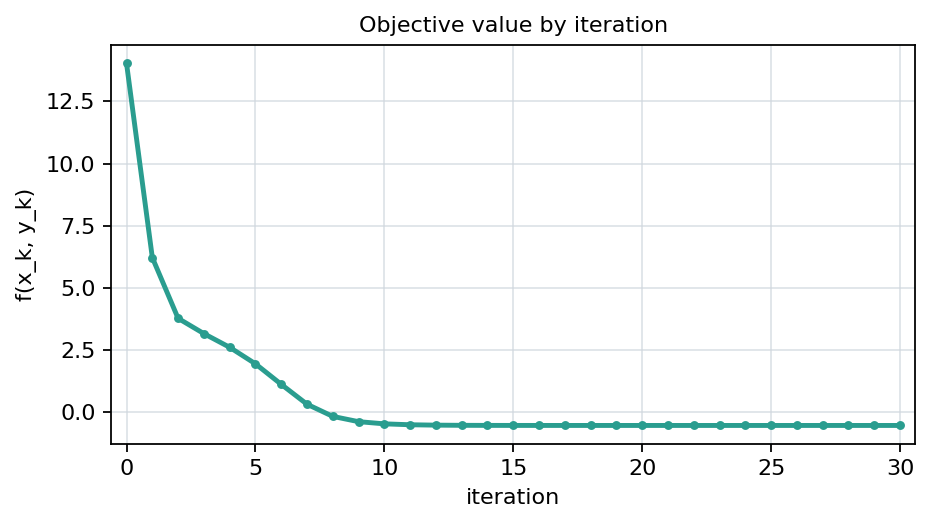

# Gradient descent on a non-convex surface

This is a compact **pi Studio** demo mixing prose, display math, generated figures, Python code, and inline annotations.

## 1. The objective

Consider the function

$$
f(x,y) = 0.35x^2 + 1.2y^2 + 0.8\sin(1.5x)\cos(2y).
$$

It is smooth, but not purely quadratic, so the sinusoidal term creates local ripples [an: define formally] in the loss landscape.

The gradient is

$$
\nabla f(x,y) =
\begin{pmatrix}
0.7x + 1.2\cos(1.5x)\cos(2y) \\
2.4y - 1.6\sin(1.5x)\sin(2y)
\end{pmatrix}.
$$

Starting from an initial point $p_0 = (x_0, y_0)$, gradient descent updates via

$$
p_{k+1} = p_k - \eta \, \nabla f(p_k),
$$

where $\eta > 0$ is the learning rate.

## 2. Optimization path in parameter space

The contour plot below shows the objective landscape together with the iterates of gradient descent. [an: did you actually run?]

{ width=420px }

The red path shows how the algorithm follows the local slope downhill. Because the surface is non-convex, the geometry is more interesting than a simple bowl-shaped quadratic.

## 3. Objective value by iteration

The next figure shows the scalar objective value $f(x_k,y_k)$ as the method runs.

{ width=400px }

A simple first-order method can still make steady progress when the step size is chosen reasonably.

## 4. Minimal Python snippet

```python
import numpy as np

def f(x, y):
    return 0.35 * x**2 + 1.2 * y**2 + 0.8 * np.sin(1.5 * x) * np.cos(2.0 * y)

def grad(x, y):
    dfdx = 0.7 * x + 1.2 * np.cos(1.5 * x) * np.cos(2.0 * y)
    dfdy = 2.4 * y - 1.6 * np.sin(1.5 * x) * np.sin(2.0 * y)
    return np.array([dfdx, dfdy])

p = np.array([-3.4, 2.8], dtype=float)
eta = 0.14
for _ in range(30):
    p = p - eta * grad(*p)
```

## 5. Why this works well as a Studio demo

- the math is recognizable but not too heavy
- the figures are visually appealing
- the code is short and readable
- the preview shows equations, prose, code, images, annotations, and outline navigation together in one place

Demo assets:

- `assets/demo/gradient-descent-demo.md`
- `assets/demo/gradient_descent_demo.py`
- `assets/demo/generated/gradient_descent_contour.png`
- `assets/demo/generated/gradient_descent_convergence.png`
