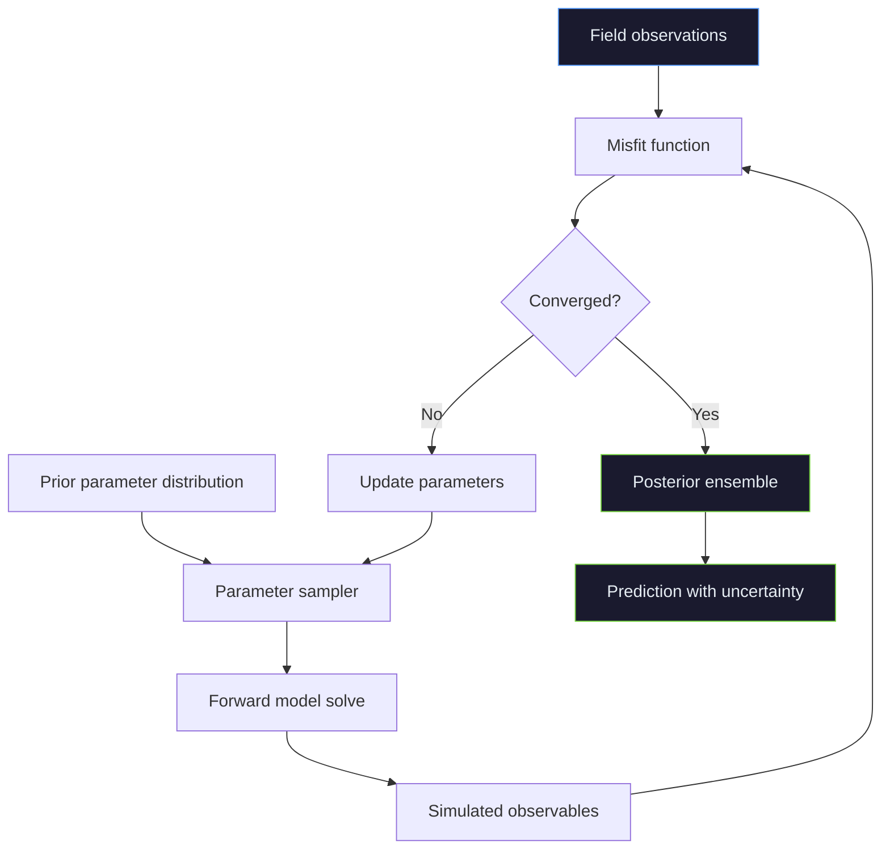

# Model calibration pipeline

Inverse problem workflow for geothermal reservoir calibration: observed data constrains model parameters through iterative forward solves.

## Data types

| Observable | Measurement | Uncertainty |
|---|---|---|
| Downhole temperature | PT logs at steady state | ±2°C sensor + borehole effects |
| Production enthalpy | Separator measurements | ±20 kJ/kg (two-phase sampling) |
| Surface heat flux | Shallow gradient holes | ±15% (ground conditions) |
| Pressure drawdown | Wellhead transducers | ±0.5 bar |

The forward model maps permeability, porosity, and boundary conditions to these observables. The inverse problem is ill-posed — regularisation via prior information prevents overfitting to noisy data.
